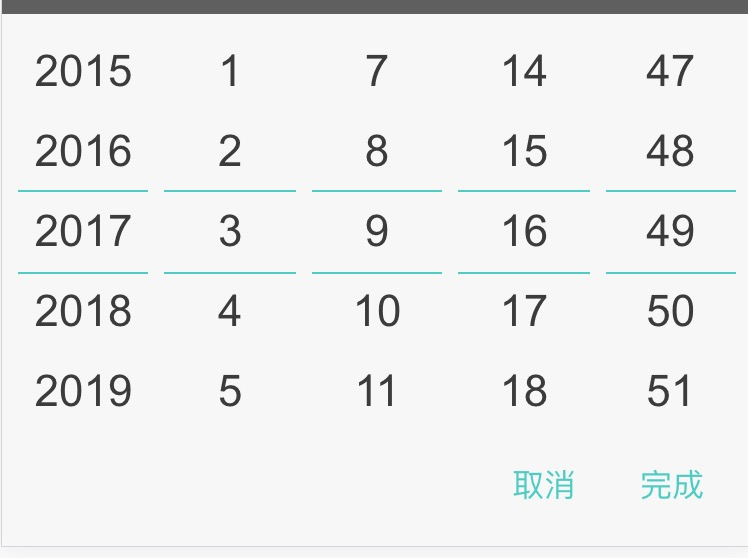
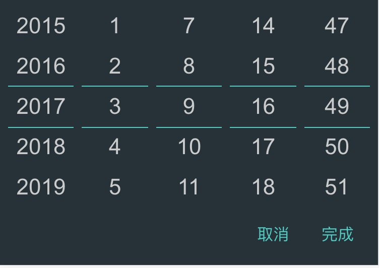
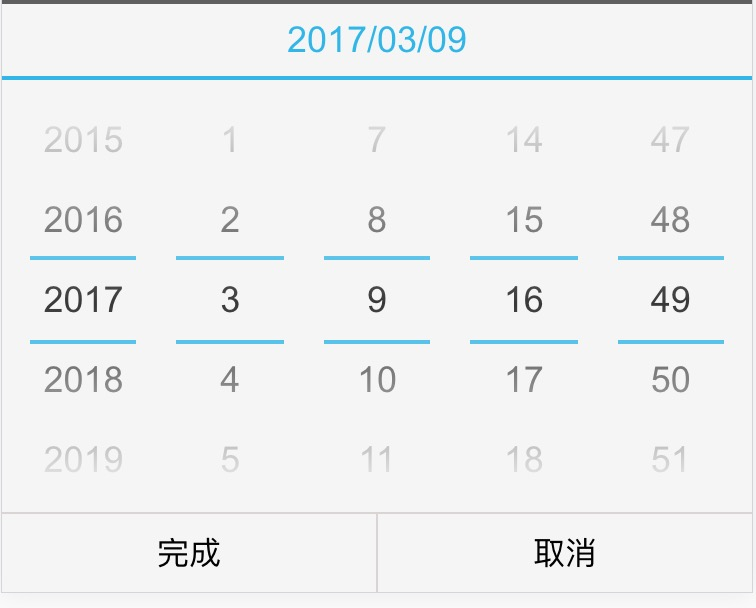

# react-mobile-datetimepicker
[](https://travis-ci.org/LunaYJ/react-mobile-datetimepicker)


**一个轻量级的react移动端日期时间选择器<br /> 基于 https://github.com/lanjingling0510/react-mobile-datetimepicker**

react-mobile-datetimepicker可以通过上下滑动来设置年、月、日、时、分。

## Features
- is only 4k.
- It does not depend on moment.js

## Screenshots
### default
<div style="padding:30px">



</div>

### dark
<div style="padding:30px">


</div>

### ios
<div style="padding:30px">


</div>

### android
<div style="padding:30px">


</div>

### android-dark
<div style="padding:30px">


</div>

## Getting Started

### Install

Using [npm](https://www.npmjs.com/):

	$ npm install react-mobile-datetimepicker --save

### Import what you need
The following guide assumes you have some sort of ES2015 build set up using babel and/or webpack/browserify/gulp/grunt/etc.


```js
// Using an ES6 transpiler like Babel
import  React from 'react';
import ReactDOM from 'react-dom';
import DateTimePicker from 'react-mobile-datetimepicker';
```


### Usage Example


```js
class App extends React.Component {
	state = {
		time: new Date(),
		isOpen: false,
	}

	handleClick = () => {
		this.setState({ isOpen: true });
	}

	handleCancel = () => {
		this.setState({ isOpen: false });
	}

	handleSelect = (time) => {
		this.setState({ time, isOpen: false });
	}

	render() {
		return (
			<div className="App">
				<a
					className="select-btn"
					onClick={this.handleClick}>
					select time
				</a>

				<DateTimePicker
					value={this.state.time}
					isOpen={this.state.isOpen}
					onSelect={this.handleSelect}
					onCancel={this.handleCancel} />
			</div>
		);
	}
}


ReactDOM.render(<App />, document.getElementById('react-box'));
```


## PropTypes

| Property        | Type           | Default  | Description |
|:------------- |:------------- |:-------------- |:---------- |
| confirmTxt      | String | '完成' | set confirm text |
| cancelTxt      | String | '取消' | set cancel text |
| isPopup      | Boolean | true | whether  as popup add a overlay |
| isOpen      | Boolean | false | whether to open datetimepicker |
| theme      | String      | default  | theme of datetimepicker, include 'default', 'dark', 'ios', 'android', 'android-dark' |
| dateFormat | Array     | ['YYYY', 'M', 'D'，'hh','mm'] | according to year, month, day format specified display text. E.g ['YYYY年', 'MM月', 'DD日','hh时','mm分钟']|
| value | Date | new Date() | date value |
| min  | Date | new Date(1970, 0, 1) | minimum date |
| max | Date | new Date(2050, 0, 1) | maximum date |
| onSelect | Function | () => {} | the callback function after click button of done, Date object as a parameter |
| onCancel | Function | () => {} | the callback function after click button of cancel |

## Changelog
* [Changelog](CHANGELOG.md)

## How to Contribute

Anyone and everyone is welcome to contribute to this project. The best way to
start is by checking our [open issues](https://github.com/LunaYJ/react-mobile-datetimepicker/issues)
participate in discussions, upvote or downvote the issues you like or dislike.

